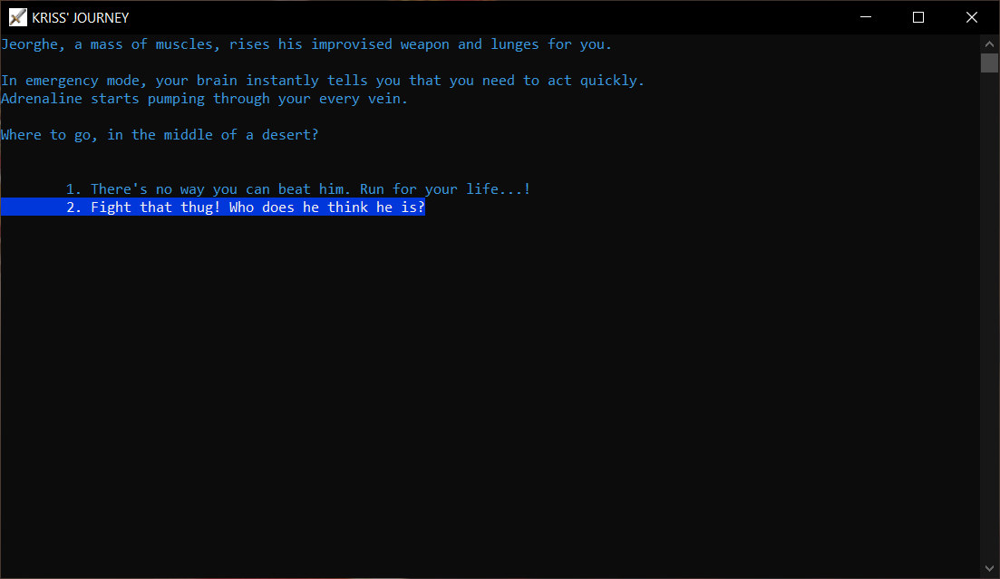
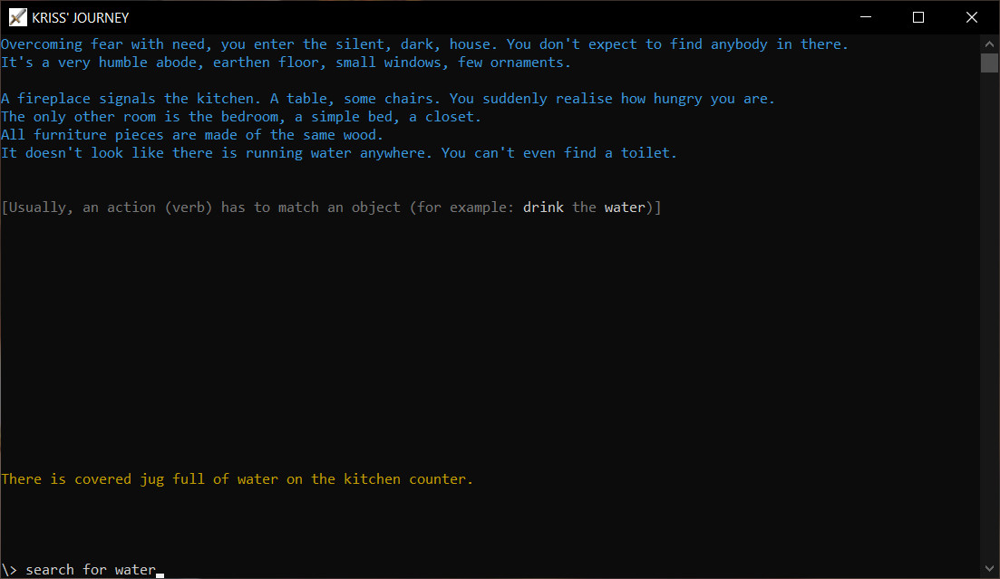

Kriss' Journey is an interactive fiction game running in your terminal.
You will experience the story through the protagonist's eyes.

### Make the right choices

What would you do...?

### Perform actions

Type stuff and try doing things. An help menu will appear for your convenience, if you dare press TAB

### Revel in fully fledged shell-like graphics

Make sure you have a color monitor in order to fully enjoy the game stunning graphics

---

This game is the result of my love for video games, story telling, computers and coding. Thus, it is open source and will be free for everybody and forever even after the development is completed.
If you enjoy the game and if you want to support my work, you can buy me a coffee:

